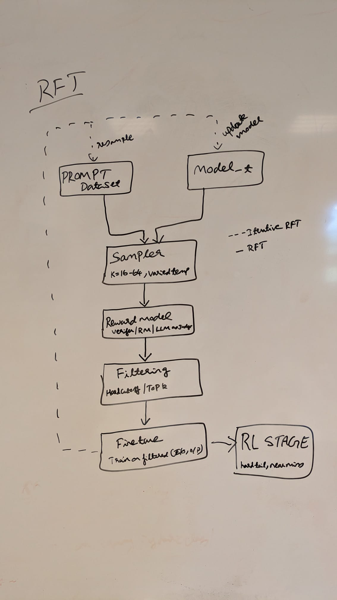
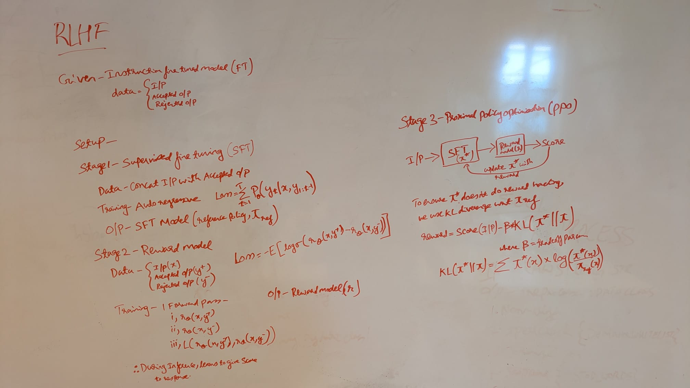
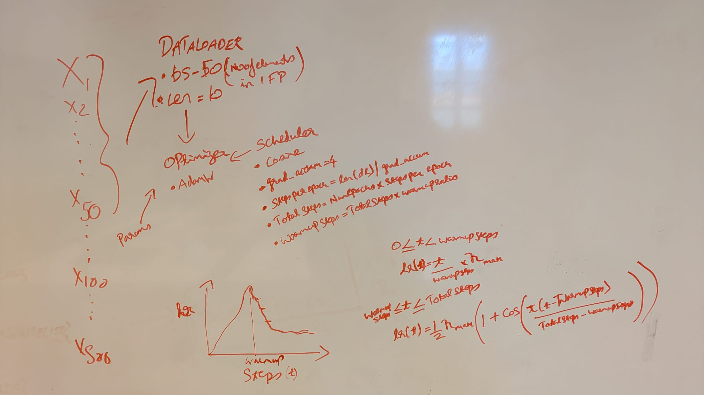

# llm-alignment

> An Implementation of RLHF and DPO alignment techniques, built on GPT-2 using the Anthropic HH-RLHF dataset.

---

## Overview

This repository demonstrates two dominant approaches to aligning large language models with human preferences:

1. **RLHF** (Reinforcement Learning from Human Feedback) — the original three-phase pipeline pioneered by InstructGPT.
2. **DPO** (Direct Preference Optimization) — a more recent, RL-free alternative that achieves comparable alignment without an explicit reward model or PPO loop.

Both pipelines are trained on the **Anthropic HH-RLHF helpfulness subset**, which provides human-written preference pairs: for each prompt, a chosen (preferred) response and a rejected (dispreferred) response.

The base model throughout is **GPT-2** (`gpt2`). It is small enough to train on a single GPU yet large enough to observe meaningful alignment behaviour.

---

## Rejection Fine-Tuning — the Step Before RL

Before committing to a full RL loop, it is worth asking whether the model already knows the right answer but just does not produce it reliably. Rejection Fine-Tuning (RFT) addresses exactly this. You sample multiple responses from the model for each prompt, keep only the ones that are verifiably correct, and fine-tune on those. No reward model is needed (the correctness signal comes from a ground-truth checker, so the training data is generated by the model itself).

This works well as a warmup stage. The model gets easy wins on examples it almost got right, which shifts the distribution toward higher-quality outputs without the instability of early RL training. Once performance stops improving (the model has extracted most of what it can from self-generated correct samples), that is the signal to hand off to RL, which can explore and improve on examples the model currently gets wrong.

**Where RFT falls short**

For responses the model gets wrong, there is no gradient signal about how wrong they were or how much correction is needed (a response that was nearly right and one that was completely off look identical to RFT — both are simply discarded). RL with a reward model does not have this limitation because the reward assigns a scalar to every response, including the bad ones.

The training data is also fixed at the time of sampling. As the model improves, samples from an earlier collection round become stale (they no longer reflect the current model's distribution, and training on them can slow progress or cause the model to overfit to an outdated policy).

**Iterative RFT** addresses the staleness problem directly. Instead of sampling once and training to convergence, you alternate between sampling from the current model and fine-tuning on the fresh correct samples. Each round, the model generates data that reflects where it currently stands, so the training signal stays on target (this is more expensive but substantially more effective than a single-pass approach, and it closely mirrors the online data collection that makes RL powerful).

---

## The 3-Phase RLHF Pipeline

**Phase 1 — Supervised Fine-Tuning (SFT)**
- Start from a pretrained GPT-2 checkpoint
- Fine-tune on the chosen (preferred) responses using standard next-token prediction
- This gives a well-formatted starting point before any RL training begins

**Phase 2 — Reward Model Training**
- Take the SFT model and add a small linear head on top that outputs a single scalar score
- Train it on preference pairs using the Bradley-Terry ranking loss: the loss pushes the model to give a higher score to the chosen response than the rejected one, by taking the negative log sigmoid of the score difference
- The trained reward model translates noisy human preferences into a smooth, differentiable signal

**Phase 3 — PPO Fine-Tuning**
- Load the SFT model twice: one copy is the active policy being trained, the other is a frozen reference policy that never updates
- For each prompt, sample a response from the active policy and score it with the reward model
- Subtract a KL penalty (scaled by beta) from the reward to prevent the active policy from drifting too far from the reference — this stops reward hacking
- Run a PPO gradient update on the active policy using the penalised reward

---

## Learning Rate Schedule

All three RLHF phases use a warmup period followed by cosine annealing. The learning rate rises linearly from zero during warmup, then decays smoothly following a cosine curve down to near zero by the end of training. This avoids large early updates (which can destabilise a pretrained model) while still allowing the rate to stay high through most of training before tapering off.

---

